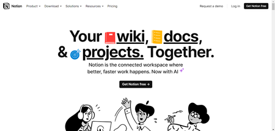
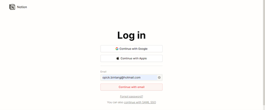
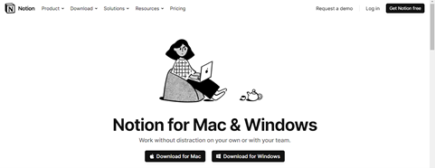
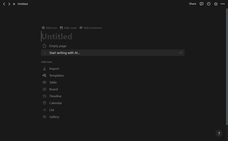
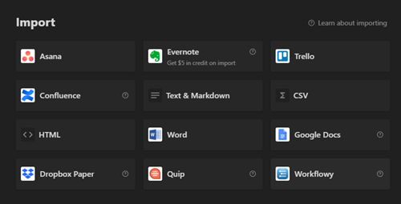
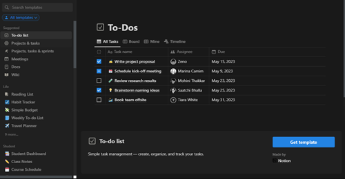
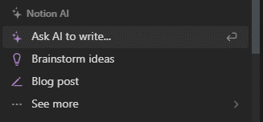
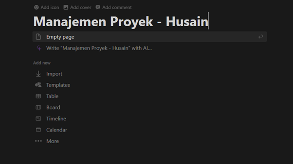

# dokumentasi-tools-manpro
Ditujukan untuk Tugas Manajemen Proyek

Dokumentasi Lengkap : https://www.academia.edu/101733006/DOKUMENTASI_PERBANDINGAN_TOOLS_MANAJEMEN_PROYEK_NOTION_DENGAN_FOCALBOARD
-----
# Notion

Notion merupakan  salah satu tools manajemen proyek yang dapat dijalankan di berbagai sistem operasi. Notion juga dapat dijalankan di web browser, jadi pengguna tidak perlu melakukan penginstallan di personal computer mereka. Untuk menggunakan notion yang bisa kolaborasi dengan tim, pengguna akan dikenakan biaya berlangganan dan sebagai gantinya dapat menikmati fitur-fitur berbayar salah satunya terdapat fitur Artificial Intelligence. Notion dapat digunakan sebagai
- To-do list
- Reading list
- Habit tracker
- Simple budget
- Blog post
- Class notes
- Design system
- Meeting agenda
- Project & tasks
- Dan masih banyak lagi

Dalam menggunakan notion terdapat 2 cara yaitu dengan instalasi maupun tanpa instalasi. Tanpa instalasi yaitu dengan cara membuka website notion di https://www.notion.so/login. 

Jika pengguna ingin menginstallnya ke komputer pribadi, dapat diunduh pada link https://www.notion.so/desktop   dan dapat diunduh sesuai sistem operasi yang digunakan.

Untuk panduan lengkap tentang notion dapat diakses pada https://www.notion.so/help

# Fitur-fitur
Terdapat beberapa fitur utama pada notion diantaranya ialah :
1. View

View pada Notion seperti Table, Board, Calendar dan Gallery terdapat juga pada Notion. Di Notion juga terdapat tambahan view berupa Timeline dan List View.

2. Import

Notion dapat melakukan import dari berbagai aplikasi seperti Trello, Google Docs, Word dan masih banyak lagi.

3. Template

Notion juga menyediakan berbagai macam template mulai dari template untuk sehari-sehari seperti to-do list hingga template proyek manajemen.

4. AI

Sebagai tools manajemen proyek, Notion juga menyediakan AI secara gratis untuk 20 kali penggunaan. AI ini dapat digunakan untuk menulis tentang ide-ide yang telah dibuat secara garis besar kemudian dilanjutkan dengan AI.

# Tutorial Penggunaan Notion pada Manajemen Proyek

Pertama-tama, pengguna dapat memberikan judul yang ingin diberikan semisal pada Gambar diatas saya memberikan judul “Manajemen Proyek – Husain” dan kemudian memilih view apa yang akan dipilih.
-----

Focalboard merupakan salah satu tools manajemen proyek yang berbasis open-source yang dibuat oleh perusahaan bernama Mattermost. Focalboard dapat diunduh di https://www.focalboard.com/docs/personal-edition/desktop/

Focalboard sendiri dapat mengakselerasi produktivitas tim dengan mengorganisasi satu sumber sehingga tim dapat fokus menyelesaikan tugas dan meraih tujuan dari proyek maupun perusahaan. Focalboard dapat digunakan di berbagai sistem operasi seperti MacOs, Linux dan Windows. Beberapa kegunaan focalboard ialah antara lain dapat digunakan sebagai :
-	Meeting agenda
-	Sales pipeline crm
-	Personal task
-	Project task
-	Company goals and OKRS
-	Personal goals
-	Sprint planner
-	User research session
-	Competitive analysis
-	Content calendar
-	Team retrospective
-	Roadmap

-----

Berikut merupakan sekilas perbandingan tools manajemen proyek notion dengan focalboard

