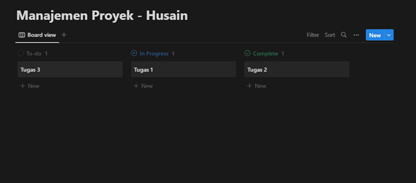

# dokumentasi-tools-manpro
Ditujukan untuk Tugas Manajemen Proyek

Dokumentasi Lengkap : https://www.academia.edu/101733006/DOKUMENTASI_PERBANDINGAN_TOOLS_MANAJEMEN_PROYEK_NOTION_DENGAN_FOCALBOARD

Daftar Isi
- [Tentang Notion](https://github.com/opickbintang19/dokumentasi-tools-manpro/blob/master/README.md#notion)
- [Fitur-fitur pada Notion](https://github.com/opickbintang19/dokumentasi-tools-manpro/blob/master/README.md#fitur-fitur-notion)
- [Tutorial Notion](https://github.com/opickbintang19/dokumentasi-tools-manpro/blob/master/README.md#tutorial-penggunaan-notion-pada-manajemen-proyek)

# Notion

Notion merupakan  salah satu tools manajemen proyek yang dapat dijalankan di berbagai sistem operasi. Notion juga dapat dijalankan di web browser, jadi pengguna tidak perlu melakukan penginstallan di personal computer mereka. Untuk menggunakan notion yang bisa kolaborasi dengan tim, pengguna akan dikenakan biaya berlangganan dan sebagai gantinya dapat menikmati fitur-fitur berbayar salah satunya terdapat fitur Artificial Intelligence. Notion dapat digunakan sebagai
- To-do list
- Reading list
- Habit tracker
- Simple budget
- Blog post
- Class notes
- Design system
- Meeting agenda
- Project & tasks
- Dan masih banyak lagi

Dalam menggunakan notion terdapat 2 cara yaitu dengan instalasi maupun tanpa instalasi. Tanpa instalasi yaitu dengan cara membuka website notion di https://www.notion.so/login. 

Jika pengguna ingin menginstallnya ke komputer pribadi, dapat diunduh pada link https://www.notion.so/desktop   dan dapat diunduh sesuai sistem operasi yang digunakan.

Untuk panduan lengkap tentang notion dapat diakses pada https://www.notion.so/help

# Fitur-fitur Notion
Terdapat beberapa fitur utama pada notion diantaranya ialah :
1. View

View pada Notion seperti Table, Board, Calendar dan Gallery terdapat juga pada Notion. Di Notion juga terdapat tambahan view berupa Timeline dan List View.

2. Import

Notion dapat melakukan import dari berbagai aplikasi seperti Trello, Google Docs, Word dan masih banyak lagi.

3. Template

Notion juga menyediakan berbagai macam template mulai dari template untuk sehari-sehari seperti to-do list hingga template proyek manajemen.

4. AI

Sebagai tools manajemen proyek, Notion juga menyediakan AI secara gratis untuk 20 kali penggunaan. AI ini dapat digunakan untuk menulis tentang ide-ide yang telah dibuat secara garis besar kemudian dilanjutkan dengan AI.
s

# Tutorial Penggunaan Notion pada Manajemen Proyek

Pengguna dapat memberikan judul pada proyek yang ingin ditambahkan seperti gambar diatas dan kemudian memilih view apa yang akan dipilih.

Sebagai contoh, saya memilih view berupa Board yang dan memberikan nama untuk masing-masing card yang ada dengan Tugas 1, Tugas 2 dan Tugas 3.

Pada Gambar diatas, card tersebut akan menggunakan 3 properti yaitu Status, Deadline, dan URL dalam mengatur manajemen proyek yang ada.

Content pada card Tugas 1 akan saya isi dengan heading dan bulleted list serta mengisi properti status, deadline dan url. Selanjutnya pengguna dapat mengkustomisasi sesuai dengan properties dan content yang ingin digunakan.

- Board View

Tampilan ini memudahkan pengguna dalam melihat proyek berdasarkan kategorinya.
- Table View

Tampilan ini memudahkan pengguna dalam secara rinci dengan properties yang ada. Pada table view tampilan ini juga terdapat fitur yang dapat menghitung sum,average,median dsb.
- Timeline View

Timeline view akan membuat pengguna dapat memprioritaskan secara jelas dalam mengerjakan proyek terdekat terlebih dulu.
- Calendar View

Calendar view berguna dalam melihat deadline pada cards yang sudah ditambahkan. Selain itu dapat melihat cards-cards lainnya secara lebih luas.
- List View

List view menampilkan card dalam bentuk list, hal ini lebih berguna jika card yang ditambahkan dalam jumlah yang banyak dan dapat mengurutnya maupun mengelompokkannya berdasarkan properti tertentu.
- Gallery View

Gallery view menampilkan preview berupa isi yang ada pada card, sehingga pengguna dapat melihat tanpa harus mengkliknya untuk melihat lebih detail.

Focalboard
-----
Daftar Isi
- [Tentang Focalboard](https://github.com/opickbintang19/dokumentasi-tools-manpro/blob/master/README.md#focalboard)
- [Fitur-fitur Focalboard](https://github.com/opickbintang19/dokumentasi-tools-manpro/blob/master/README.md#fitur-fitur-focalboard)
- [Tutorial Focalboard](https://github.com/opickbintang19/dokumentasi-tools-manpro/blob/master/README.md#tutorial-focalboard)

# Focalboard

Focalboard sendiri dapat mengakselerasi produktivitas tim dengan mengorganisasi satu sumber sehingga tim dapat fokus menyelesaikan tugas dan meraih tujuan dari proyek maupun perusahaan. Focalboard dapat digunakan di berbagai sistem operasi seperti MacOs, Linux dan Windows. Beberapa kegunaan focalboard ialah antara lain dapat digunakan sebagai :
-	Meeting agenda
-	Sales pipeline crm
-	Personal task
-	Project task
-	Company goals and OKRS
-	Personal goals
-	Sprint planner
-	User research session
-	Competitive analysis
-	Content calendar
-	Team retrospective
-	Roadmap

Focalboard merupakan salah satu tools manajemen proyek yang berbasis open-source yang dibuat oleh perusahaan bernama Mattermost. Focalboard dapat diunduh di https://www.focalboard.com/docs/personal-edition/desktop/ , diunduh pada Microsoft Store dan dapat diunduh melalui github focalboard

# Fitur-fitur Focalboard
1. View

Terdapat 4 macam view pada focalboard yang dapat disesuaikan dengan kebutuhan pengguna

2. Properties

Pengguna dapat memilih properties yang ingin disertakan ke dalam card diantaranya :
- Text dapat digunakan untuk menambahkan catatan pendek ke kartu. Keuntungan dari properti teks dibandingkan deskripsi kartu adalah dapat ditampilkan di papan tulis tanpa perlu membuka kartu.
- Numbers berguna untuk menangkap metrik seperti ukuran tugas atau perkiraan upaya.
- Email and Phone berguna untuk mencatat informasi kontak
- URL dapat digunakan untuk memberikan tautan ke permintaan penarikan atau situs web yang relevan. Mengklik kotak properti URL akan secara otomatis membuka tautan di tab baru di browser Anda.
- Select and Multi-select memungkinkan Anda membuat daftar opsi yang telah ditentukan sebelumnya yang dapat diberi kode warna dan ditampilkan sebagai lencana pada kartu untuk menunjukkan hal-hal seperti status dan prioritas.Fitur ini hanya terdapat pada fitur berbayar
- Dates berguna untuk mengatur dan melacak tanggal jatuh tempo.
- Person and Multi-person menyediakan cara cepat untuk menangkap tugas pengguna. Perhatikan bahwa ini tidak tersedia di Personal Desktop.
- Checkbox adalah properti toggle yang dapat digunakan untuk menetapkan opsi biner sederhana pada kartu seperti Benar/Salah atau Ya/Tidak.
- Created time/Created by/Last updated time/Last updated adalah properti sistem yang telah ditentukan sebelumnya untuk membantu Anda mengaudit perubahan pada kartu. Nama properti ini dapat disesuaikan, tetapi nilainya tidak.

3. Attachment

Terdapat juga attachment, yang berfungsi untuk menyertakan file pada cards yang dituju

4. Content

Konten yang dapat digunakan oleh pengguna ialah berupa text, image atau gambar, divider atau garis pembatas, dan checkbox untuk menceklis item

# Tutorial Focalboard

Pada tampilan berikut, pengguna dapat memilih apakah ingin menggunakan template yang sudah ada atau membuatnya dari nol. Untuk tahap ini saya akan memulainya dari nol.

Klik button “Create an empty board” untuk memulainya dari nol.

Ini merupakan tampilan awal jika pengguna memilih membuat board baru. Pengguna dapat memberikan judul board terlebih dahulu

Jika sudah, pengguna dapat melihat beberapa view yang disediakan oleh Focalboard, tampilan default jika membuatnya dari nol ialah Board view. Terdapat beberapa pilihan view yang disediakan diantaranya.

Keempat view berikut dapat membantu dalam memvisualisasikan item pekerjaan dengan format yang paling sesuai dengan pengguna.

Untuk membuat card baru, pengguna dapat mengklik button “+ New” yang akan diarahkan ke sebuah pop-up.

Pengguna dapat memilih ikon yang disesuaikan dengan maksud dan tujuan yang ingin dicapai

Gambar dibawah merupakan contoh dari hasil penggunaan focalboard pada manajemen proyek yang penulis lakukan.

-----

Berikut merupakan sekilas perbandingan tools manajemen proyek notion dengan focalboard

